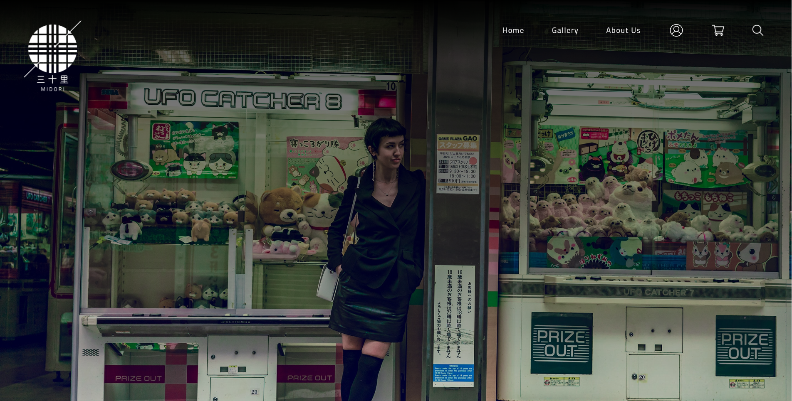

# midori

a project for practicing tailwindcss and vanilla js

#### Home

#### Gallery

#### Products

## How to Edit

1. install `node.js`
2. run `yarn` to install dependencies
3. run `yarn tailwindcss -i ./style/dev.css -o ./style/styles.css --watch` to start tailwindcss watcher

## Credits
[Jay Yuu Nanasawa](https://www.behance.net/jayyuunanasawa?tracking_source=search_users|Jay%20yuu%20nanasawa) and [Lancelot Paclibar](https://www.behance.net/shiroinora12?tracking_source=search_users|shiroi%20nora) for the UI/UX design 
